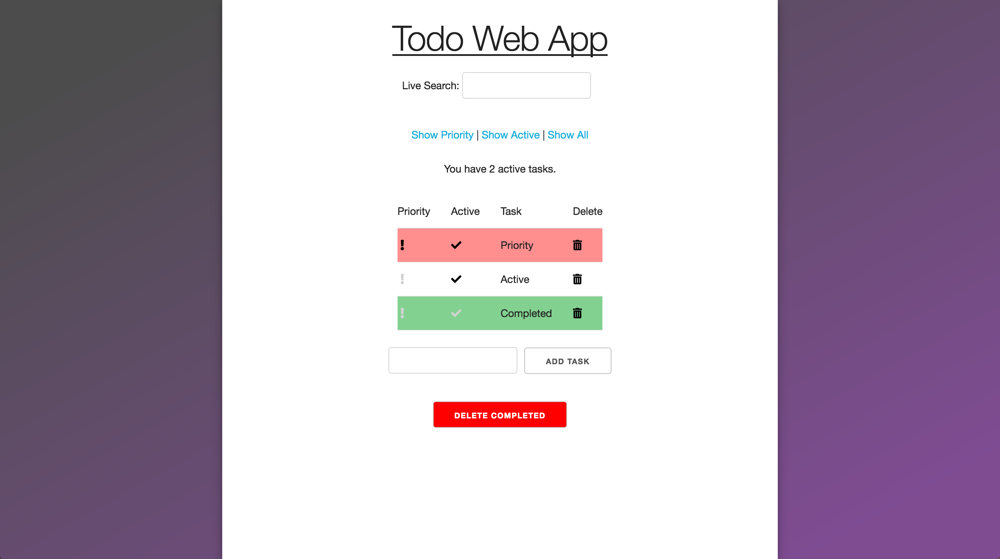

Todo Web App
============
Steps to run
------------
1. Have mongodb running on port 27017
2. Run yarn install in todo-app dir
3. Run yarn install in client dir
4. Run node server/server.js in todo-app dir
5. Run yarn start 

Information
-----------
* Green background on table row means task is completed
* Red background on table row means task is a priority
* Clicking on the exclamation/checkmark toggles active and priority status
* Tests can be run by using yarn test